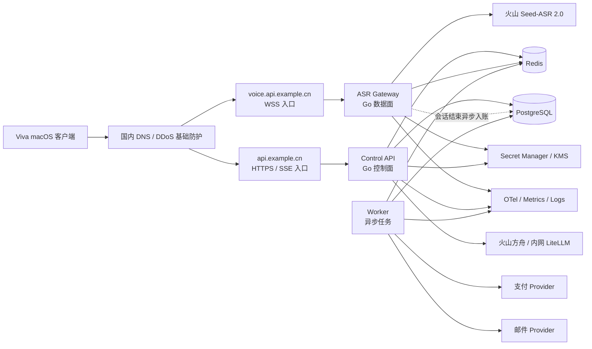

# Viva 托管服务端完整实施规格

> 版本：1.0
> 状态：Approved for implementation
> 日期：2026-07-28
> 目标读者：服务端工程师、客户端工程师、SRE、安全、测试、产品，以及负责从零实现新项目的编码 AI

---

## 0. 执行摘要

Viva 当前由 macOS 客户端携带用户自己的火山和大模型密钥，直接请求火山 Seed-ASR 2.0 和模型服务。本项目要把它升级为托管 SaaS：用户安装、授权麦克风和辅助功能后即可试用，所有音频和大模型请求先进入自有服务器，再由服务器使用集中管理的供应商凭证调用火山。

首版推荐方案是：

```text
客户端保持现有 SAUC 编码与 PCM 分包
        ↓ WSS + 自有短期 Token
Go ASR Gateway 做身份/额度准入和 SAUC 二进制透明转发
        ↓ WSS + 服务端火山长期密钥
火山 Seed-ASR 2.0 bigmodel_async

客户端最终文本
        ↓ HTTPS/SSE + 自有短期 Token
产品专用 Polish API
        ↓ 内网适配器或 LiteLLM
火山方舟低延迟模型
```

本方案的关键工程判断：

- 第一版不重写已经实测稳定的 SAUC 协议，避免破坏 partial、definite、async final、gzip 和错误帧语义。
- ASR 数据面与普通 HTTP/LLM 控制面分开部署，防止慢模型请求影响实时音频。
- 代码保持一个 Go 仓库和统一领域模型，但可用 `api`、`gateway`、`worker` 三种角色独立扩缩容。
- 用户体系采用 guest 自动试用 + 无密码升级；桌面 App 是 public client，不存在可信的静态客户端 Secret。
- 生产 Access Token 必须绑定设备密钥，Refresh Token 必须轮换和支持重放检测。
- 数据面逐帧路径只做内存和网络操作；Redis 仅在准入、心跳和释放阶段参与，PostgreSQL 不进入逐帧路径。
- 原始音频不落盘，转写正文和 LLM 正文默认不写日志或数据库。

---

## 1. 产品目标与边界

### 1.1 必须实现的用户体验

1. 用户下载安装 Viva。
2. 首次启动生成设备密钥并自动取得 guest 试用身份。
3. 用户不填写任何火山、大模型或代理 API Key。
4. 按住热键说话，现有 partial、definite、逐句上屏和长会话轮转体验保持。
5. 需要润色时，请求自有产品接口；客户端不知道实际模型凭证。
6. 用户可以查看剩余额度、当前套餐、用量记录和设备列表。
7. 用户可以登录升级 guest、购买套餐、退出设备、导出数据和注销账号。
8. 服务端能封禁滥用账号、撤销设备、调整额度、处理退款并完整审计。

### 1.2 业务目标

- 将供应商接入门槛从终端用户转移到平台运营方。
- 统一控制模型、Prompt、资源 ID、费用、并发和功能开关。
- 能按语音分钟或套餐收费，并避免重复计费。
- 能在不发布客户端的情况下调整限额、模型档位和灰度开关。
- 能观测“客户端 → 网关 → 火山 → 客户端”的分段延迟和供应商错误。
- 能在成本、容量或供应商异常时快速熔断，而不是产生无限账单。

### 1.3 非目标

- 首版不提供面向第三方开发者的通用 API 平台。
- 首版不提供任意 Prompt、任意模型、任意上游 URL 的 OpenAI 兼容代理。
- 首版不做 WebRTC、TTS、电话和全双工语音 Agent。
- 首版不存用户的完整语音历史或云端识别历史。
- 首版不承诺中转网络延迟在所有网络下绝对等于直连；承诺的是协议语义同档和额外延迟受控。
- 首版不做 Kubernetes 和跨地域 active-active。

---

## 2. 不可变技术约束

以下约束属于 P0，任何实现不得静默修改：

### 2.1 ASR 协议

- 上游固定为火山官方 `bigmodel_async` WebSocket。
- 生产 Seed-ASR 2.0 时长版资源 ID 由服务端固定为 `volc.seedasr.sauc.duration`，不得接受客户端提供的资源 ID。
- 一条下游 WebSocket 对应一条上游 WebSocket，不复用、不共享。
- 下游每条 binary message 对应上游一条 binary message；不能合并或拆分已经形成的 SAUC message。
- 火山返回 binary message 原样回传，不能改 sequence、flags、serialization、compression、payload 或 close 顺序。
- 禁止 WebSocket per-message deflate。
- 音频为 16kHz、16bit、mono、raw PCM；主分包保持 200ms，客户端可对首包做 100ms 实验，但服务端不转码。
- 客户端连接期间 Access Token 过期不得强制切断已准入会话；下一次连接前刷新即可。

### 2.2 凭证和身份

- 客户端不可包含火山、方舟、邮件、支付或数据库长期密钥。
- 客户端不可包含可被当成可信身份的静态 shared secret。
- 供应商密钥只能来自 Secret Manager/KMS 或只读运行时 Secret 文件。
- Access Token 不写磁盘；Refresh Token 只放 macOS Keychain。
- 服务端数据库只保存 Refresh Token 的 keyed hash，不保存明文。
- 管理员身份和普通用户身份使用不同 audience、权限模型和登录入口。

### 2.3 数据和隐私

- 音频默认只在客户端、网关内存和供应商网络路径中短暂存在。
- 禁止把音频、完整转写正文、LLM Prompt 或 LLM 输出写入默认日志、Trace、指标或异常上报。
- 诊断内容上传必须由用户明确开启、显示范围和过期时间，并使用独立对象存储策略。
- 用量、计费和排障使用字节数、时长、字符数、Token 数、内部 ID、状态码和火山 logid，不依赖正文。

### 2.4 数据面性能

- 音频帧转发路径不访问 PostgreSQL。
- 音频帧转发路径不调用外部认证、计费、支付、邮件或日志服务。
- 单方向仅允许一个串行 writer，避免 WebSocket 并发写和帧乱序。
- 所有缓冲必须有界；慢客户端或慢上游达到阈值后快速关闭。

---

## 3. 目标架构



### 3.1 运行角色

| 角色 | 主要职责 | 不允许承担的职责 |
|---|---|---|
| `gateway` | WSS 鉴权、DPoP、额度预留、并发租约、SAUC 校验、火山建连、双向透传、时长计量 | 邮件、支付、复杂报表、同步写正文、通用 LLM |
| `api` | bootstrap、登录、Token、用户、设备、套餐、用量查询、订单、配置、Polish SSE、管理 API | 持有长时 ASR 音频连接 |
| `worker` | OTP 邮件、支付 Webhook 后处理、用量结算、对账、隐私导出/删除、通知和定时任务 | 公开接收用户音频 |
| `migrate` | 数据库迁移与只执行一次的维护任务 | 作为长期运行服务 |

### 3.2 部署隔离

- `voice.api.example.cn` 只路由到 Gateway，链路尽量保持 L4/L7 一层负载均衡。
- `api.example.cn` 路由到 Control API，可以使用 WAF、常规限流和 HTTP 缓存。
- `admin.example.cn` 只允许企业 OIDC + MFA，并通过 VPN/零信任访问。
- Gateway 和 API 使用不同实例池、不同 autoscaling 策略和不同 Redis/DB 权限。
- LiteLLM 如启用，只监听私网，不对客户端开放。

---

## 4. 技术栈

### 4.1 核心选型

| 层 | 推荐 | 说明 |
|---|---|---|
| 语言 | Go 当前稳定版，`go.mod` 和 CI 锁定具体 toolchain | 实时网络、并发和部署成本平衡最好 |
| HTTP 路由 | `net/http` + `chi` | 接近标准库，Middleware 边界清晰 |
| WebSocket | `github.com/coder/websocket` | Context 友好，明确关闭压缩并限制消息 |
| PostgreSQL | PostgreSQL 16+ | 用户、订阅、订单、用量和审计事实来源 |
| DB 驱动 | `pgx/v5` | 性能、批量和类型支持成熟 |
| SQL | `sqlc` + 手写 SQL | 避免 ORM 隐式查询和越权条件遗漏 |
| 迁移 | `goose` 或 Atlas；项目只选一个 | 迁移由独立 Job 执行 |
| Redis-compatible | Valkey 8+ 或许可证明确的托管 Redis + `go-redis/v9` | 限流、DPoP 重放、额度预留和租约 |
| 日志 | 标准库 `log/slog` JSON Handler | 结构化、依赖少；统一脱敏 Handler |
| Token/JWS | `lestrrat-go/jwx/v2` | JWT、JWK、EdDSA/ES256 和 DPoP 支持 |
| 验证 | `go-playground/validator/v10` + 领域校验 | HTTP 结构和业务规则分开 |
| Telemetry | OpenTelemetry Go + Prometheus exporter | Trace、Metric 和日志关联 |
| LLM | 首版直接方舟 Adapter；多 Provider 后用内网 LiteLLM | 不让 LiteLLM进入 ASR 数据面 |
| API 契约 | OpenAPI 3.0.3 + AsyncAPI 3 | 兼顾 Go/Swift 代码生成、Mock 和契约测试 |
| 容器 | Multi-stage Docker + distroless/non-root | 只读文件系统、最小攻击面 |

### 4.2 依赖策略

- 直接依赖数量保持少；每个关键依赖必须在 `docs/dependencies.md` 记录用途、许可证和替代方案。
- `go.mod`、Docker 基础镜像和 CI Action 均锁定版本；生产镜像锁定 digest。
- 每周运行 `govulncheck`、依赖更新检查和镜像扫描。
- 不直接复制 AGPL 项目代码进入闭源服务；LiteLLM 只使用其允许的主体部分，enterprise 目录单独评估。
- 任何 SDK 不得自动记录请求正文或 Header。

---

## 5. 代码架构与模块边界

### 5.1 推荐包结构

```text
internal/
├── auth/
│   ├── service.go           # bootstrap、OTP、refresh、logout
│   ├── tokens.go            # JWT/JWK/refresh rotation
│   ├── dpop.go              # RFC 9449 验证与重放保护
│   ├── repository.go
│   └── handler.go
├── accounts/                # user、identity、consent、状态机
├── devices/                 # 设备注册、撤销、最后活跃
├── entitlements/            # 套餐权益、额度、并发、缓存
├── asrproxy/
│   ├── handler.go           # Upgrade 与生命周期
│   ├── sauc.go              # 最小只读帧校验
│   ├── relay.go             # 双向串行 pump
│   ├── provider_volc.go
│   ├── lease.go
│   ├── meter.go
│   └── errors.go
├── polish/
│   ├── service.go
│   ├── prompt.go            # 服务端 Prompt 版本化
│   ├── provider.go
│   ├── sanity.go
│   └── handler.go
├── usage/                   # session、ledger、counter、对账
├── billing/                 # plan、subscription、order、provider adapter
├── privacy/                 # 导出、删除、保留策略
├── clientconfig/            # 远程配置、签名和灰度
├── admin/                   # RBAC 管理接口
└── platform/
    ├── db/
    ├── redisx/
    ├── httpx/               # 错误、分页、幂等、request ID
    ├── secrets/
    ├── clock/               # 可测试时间源
    └── telemetry/
```

### 5.2 领域接口

关键逻辑必须依赖接口而不是具体云 SDK：

```go
type ASRProvider interface {
    Dial(ctx context.Context, meta SessionMeta) (UpstreamSocket, ProviderHandshake, error)
}

type EntitlementService interface {
    ReserveASR(ctx context.Context, subject Subject, requested time.Duration) (Reservation, error)
    CommitASR(ctx context.Context, reservationID string, actual Usage) error
    ReleaseASR(ctx context.Context, reservationID string) error
}

type PolishProvider interface {
    Complete(ctx context.Context, req ProviderPolishRequest) (ProviderPolishResponse, error)
    Stream(ctx context.Context, req ProviderPolishRequest, sink DeltaSink) (ProviderUsage, error)
}

type SecretSource interface {
    Current(ctx context.Context, name string) (SecretVersion, error)
}
```

要求：

- 生产火山实现、Fake Upstream 和故障注入实现使用同一接口。
- Handler 不直接写 SQL；领域服务不依赖 HTTP 类型。
- 领域错误使用稳定 code，HTTP、WebSocket、日志和指标分别映射。
- 时间、随机数、ID 生成和外部请求必须可在测试中替换。

---

## 6. 身份、认证和用户体系

### 6.1 用户类型

| 类型 | 创建方式 | 能力 |
|---|---|---|
| `guest` | 首次 bootstrap 自动创建 | 受限试用、不可购买或仅允许升级后购买 |
| `registered` | 邮箱 OTP 或 OIDC 验证并升级/登录 | 套餐、跨设备、隐私权利、支付 |
| `admin` | 企业 OIDC/SSO 映射 | 由 RBAC 决定管理权限 |
| `service` | Workload Identity | 仅内部服务调用，不能登录客户端 |

Guest 升级必须保留原 user ID，或在单一事务中迁移设备、用量、试用和订单预创建记录，避免重复账号和额度。

### 6.2 设备身份

首次启动：

1. 客户端在 Keychain/Secure Enclave 生成 P-256 signing key。
2. 客户端生成随机 `install_id`；它只用于幂等和风控，不被视为可信凭证。
3. 客户端向 `/v1/client/bootstrap` 发送 public JWK、平台、版本、locale 和 timezone。
4. 请求携带无 Access Token 的 DPoP proof，JWK 必须与 body 一致。
5. 服务端按 IP、设备键 thumbprint、安装标识哈希和风险规则决定创建或恢复 guest。
6. 返回短期 Access Token、一次性可见的 Refresh Token、device ID 和 entitlement。

设备私钥永远不上传。撤销设备会撤销该设备所有 Refresh Token family，并提升相关撤销版本。

### 6.3 Access Token

建议：

- JWT，EdDSA/Ed25519 签名；若当前 KMS 不支持则使用 ES256。
- 生命周期 10 分钟，最大不超过 15 分钟。
- audience：桌面客户端为 `viva-desktop`；管理员为 `viva-admin`；内部服务另设 audience。
- 公钥通过 `/.well-known/jwks.json` 发布，使用 `kid` 支持轮换。

最低 Claims：

```json
{
  "iss": "https://api.example.cn",
  "aud": "viva-desktop",
  "sub": "user_uuid",
  "did": "device_uuid",
  "acct": "guest|registered",
  "roles": ["user"],
  "tv": 3,
  "cnf": {"jkt": "device_key_thumbprint"},
  "jti": "uuidv7",
  "auth_time": 1785200000,
  "amr": ["otp"],
  "iat": 1785200000,
  "nbf": 1785200000,
  "exp": 1785200600
}
```

`tv` 是用户 Token Version；执行“退出全部设备”、封禁或高风险处置时提升。数据面优先使用本地 JWT 验签，短 Token 自然过期；强制撤销可使用 Redis 的 user/device version 缓存。

`auth_time` 表示最近一次真实用户认证时间，`amr` 表示认证方式。全设备退出、账号删除等 step-up 操作要求 `server_now - auth_time ≤ 5 分钟`，且 `amr` 至少包含 `otp`、`oidc` 或 `passkey`。不满足时返回 `RECENT_AUTH_REQUIRED`，客户端完成 `purpose=recent_auth` 的 OTP/OIDC 流程并取得新 Token 后重试；不能信任请求 body 自报“已重新认证”。

### 6.4 DPoP

生产 API 和 WSS 使用 RFC 9449 DPoP：

- 普通用户的受保护请求同时携带 `Authorization: DPoP <access-token>` 和 `DPoP: <proof-jwt>`；不得接受 Bearer 形式的普通用户 Token。
- Proof protected header 固定 `typ=dpop+jwt`、`alg=ES256`、`jwk=<设备公钥>`；拒绝对称算法、`none`、私钥参数和算法降级。
- 每次请求带 `DPoP: <proof-jwt>`。
- Proof 至少包含 `jti`、`htm`、`htu`、`iat`，有 Access Token 时包含 `ath`。
- `ath = base64url(SHA-256(ASCII(access_token)))`，使用无 padding 的 base64url。
- `htm` 使用大写 HTTP 方法；`htu` 不含 query 和 fragment。
- WebSocket 虽以 `wss://voice.api.example.cn/v1/asr/stream` 连接，opening handshake 的规范 DPoP `htu` 固定为 `https://voice.api.example.cn/v1/asr/stream`；本地 `ws://` 对应 `http://`。客户端和 Gateway 必须共用同一规范化函数和 golden tests。
- 允许时钟偏差 60 秒，Proof 最大年龄 120 秒。
- `jti + key_thumbprint` 在 Redis 保存 5 分钟，重复即拒绝。
- `htu` 必须与规范化后的公开 URL 完全匹配，不信任任意转发 Header；只信任受控 LB 注入的 Forwarded 信息。
- Access Token 的 `cnf.jkt` 必须匹配 Proof JWK thumbprint。

本地开发可在 loopback 环境关闭 DPoP；预发和生产不可关闭。

### 6.5 Refresh Token

- 256bit CSPRNG 随机不透明字符串，前缀如 `vvr_`。
- 明文只返回一次，客户端存 Keychain。
- 服务端保存 `HMAC-SHA256(server_pepper, token)`；随机 Token 不需要慢密码哈希。
- 生命周期 30 天，Token family 最大滑动寿命 90 天。
- 每次刷新必须旋转，旧 Token 标记 consumed。
- 旋转事务必须 `SELECT ... FOR UPDATE` 锁定旧 Token；数据库以同 family 复合自引用和 `rotated_from_id UNIQUE` 保证一个旧 Token 最多产生一个后继。
- 刷新必须携带 Idempotency-Key。同一设备、同一旧 Token、同一 Key 和相同请求哈希在 60 秒内返回首次加密缓存的 Token 对；避免响应丢失造成误判。
- 超出上述安全重试窗口，或旧 Token 携带不同 Idempotency-Key 再次出现，视为重放：撤销整个 family、记录安全事件、要求重新登录。
- 刷新请求必须由同一设备 DPoP key 签名。
- 已撤销、过期、设备状态异常或用户 suspended 时拒绝刷新。

### 6.6 邮箱 OTP 和 OIDC

邮箱 OTP：

- `/v1/auth/otp/request` 不需要 Access Token，但必须携带 Token Endpoint DPoP proof；服务端以 proof JWK thumbprint 建立设备限流桶。
- `/v1/auth/otp/request` 无论账号是否存在均返回 202，避免枚举。
- 6 位数字或等价强度，5 分钟过期，最多尝试 5 次。
- 邮箱归一化后使用 HMAC lookup；明文邮箱使用 KMS envelope encryption 保存。
- 单邮箱 60 秒一次、每小时 5 次；单 IP 和设备另有限流。
- 验证成功后创建/绑定 identity；如果请求已带 guest 身份，执行 guest 升级。

OIDC：

- 首发可只实现 Apple；接口保持通用 `provider`。
- 服务端验证 issuer、audience、签名、nonce、exp 和 provider subject。
- 不直接信任客户端传入的邮箱、姓名或“已验证”标志。
- Provider subject 是稳定身份键；邮箱仅作为通知和辅助属性。

### 6.7 登出和撤销

- 当前设备退出：撤销当前 Refresh Token family，Access Token 最迟在 10 分钟内过期。
- 全部设备退出：提升 user token version，撤销所有 family。
- 撤销单设备：设备状态改为 revoked，撤销它的 family 和活跃会话准入。
- 已建立的 ASR 会话默认允许自然结束；涉及封禁、安全事件或成本攻击时可主动关闭。
- 管理员封禁需要原因、工单号和审计记录。

---

## 7. 授权和 RBAC

### 7.1 普通用户授权原则

- 所有资源查询都必须同时包含 `user_id = token.sub` 条件。
- 客户端不得传任意 user ID 选择其他用户资源。
- device ID 必须属于当前 user，并与 Token `did`/DPoP 规则一致。
- 套餐能力由服务端 entitlement 决定；客户端显示内容不能作为授权输入。
- 管理接口和普通用户接口使用不同路由组、audience 和 Middleware。

### 7.2 管理角色

| 角色 | 权限 |
|---|---|
| `support_readonly` | 查看脱敏用户状态、设备、会话元数据和公开错误信息 |
| `support_agent` | 在只读基础上撤销设备、重新发送验证、添加支持备注 |
| `billing_admin` | 订单、退款、套餐和额度调整；不能查看 Secret |
| `security_admin` | 封禁、解封、安全事件、Token 全量撤销、审计查询 |
| `platform_admin` | 远程配置、Provider 状态、发布和容量；不能修改账务历史 |
| `super_admin` | 仅紧急 Break-glass，双人审批和强制告警 |

OIDC 角色到 OAuth scope 的映射采用显式累计发放：`support_agent` Token 同时包含 `support_readonly` 与 `support_agent`；`billing_admin` 和 `security_admin` 同时包含 `support_readonly` 以便先完成脱敏用户定位；`super_admin` 才包含全部管理 scope。后端只判断已签名 Token 中的 scope，不按角色名自行猜测继承关系。

禁止“登录成用户”式无审计 impersonation。确需复现客户端问题时，生成范围受限、短期、只读的 support session，并由用户明确授权。

---

## 8. API 通用规范

机器可读定义以 `openapi.yaml` 为准。本节规定所有接口共同遵守的行为。

### 8.1 基础约定

- 公共版本前缀：`/v1`。
- JSON 使用 UTF-8、snake_case 字段和 RFC 3339 UTC 时间。
- ID 使用 UUIDv7，由应用生成。
- 金额使用整数最小货币单位，禁止 float。
- 时长使用整数毫秒；用量账本可使用更小的内部单位，但 API 仍返回毫秒。
- 分页使用 opaque cursor，禁止暴露数据库 offset 作为稳定契约。
- 未知 JSON 字段默认拒绝，避免客户端误以为参数生效；兼容性字段需显式标记。

### 8.2 标准请求头

| Header | 适用 | 说明 |
|---|---|---|
| `Authorization: DPoP <access-token>` | 除 bootstrap、OTP 请求、公开计划外 | RFC 9449 DPoP-bound 自有 Access Token |
| `DPoP` | 生产桌面 API 和 WSS | 设备持有证明 |
| `X-Viva-Device-ID` | 已注册设备 | 必须匹配 Token |
| `X-Viva-Client-Version` | 客户端接口 | SemVer |
| `X-Viva-Protocol-Version` | 客户端接口 | 首版为 `1` |
| `X-Request-ID` | 可选 | 合法 UUID；服务端不信任其他格式 |
| `Idempotency-Key` | 创建订单、Polish、隐私请求、管理调整等 | UUID，作用域为 user + route |
| `Accept: text/event-stream` | Polish 流式接口 | 禁止代理缓冲 |

### 8.3 标准响应头

- `X-Request-ID`：服务端最终请求 ID。
- `RateLimit-Limit`、`RateLimit-Remaining`、`RateLimit-Reset`：适用的主要限流桶。
- `Retry-After`：429、503 或维护时返回。
- `ETag`：客户端配置、计划和可缓存只读资源。
- `Cache-Control: no-store`：Token、用户、用量、订单和隐私接口。

### 8.4 错误格式

```json
{
  "error": {
    "code": "QUOTA_EXHAUSTED",
    "message": "本月语音额度已用完",
    "request_id": "019b...",
    "retryable": false,
    "retry_after_ms": 0,
    "details": {
      "resource": "asr_audio_ms",
      "reset_at": "2026-08-01T00:00:00Z"
    }
  }
}
```

`message` 面向用户但不暴露 Secret、SQL、Provider 原始正文或内部栈。客户端逻辑必须使用稳定 `code`，不能解析 message。

### 8.5 幂等

- 相同 subject、route、Idempotency-Key 和相同请求哈希：返回首次结果；普通接口 subject 为 user，refresh/bootstrap 等发 Token 接口使用已验证的 device/token family subject。
- 相同 Key、不同请求哈希：409 `IDEMPOTENCY_CONFLICT`。
- 订单和配额调整至少保留 30 天；Polish 保留 24 小时且不保存正文，只保存请求 keyed hash 和响应元数据。
- Webhook 使用 Provider event ID 做永久或按法规期限的去重。

### 8.6 速率限制

限流至少按 user、device、IP 前缀、route 和全局 Provider 容量组合执行。429 必须携带稳定错误码和 Retry-After。实时语音容量不足时快速失败，不进入服务端排队。

---

## 9. 完整外部接口清单

### 9.1 系统和配置

| 方法 | 路径 | 认证 | 用途 |
|---|---|---|---|
| GET | `/healthz` | 无；仅 LB | Liveness，只检查进程 |
| GET | `/readyz` | 内网/LB | Readiness，不接受新流量时失败 |
| GET | `/.well-known/jwks.json` | 无 | JWT 公钥 |
| GET | `/v1/service/status` | 可选 | 维护、Provider 降级和区域状态 |
| GET | `/v1/client/config` | DPoP Access Token | 远程配置、限额、协议和灰度能力 |

### 9.2 认证

| 方法 | 路径 | 认证 | 用途 |
|---|---|---|---|
| POST | `/v1/client/bootstrap` | Token Endpoint DPoP proof | 创建/恢复 guest 和设备 |
| POST | `/v1/auth/otp/request` | Token Endpoint DPoP proof | 发送邮箱验证码并提供设备级防刷信号 |
| POST | `/v1/auth/otp/verify` | 可选 guest DPoP Access Token | 登录或升级 guest |
| POST | `/v1/auth/oidc/exchange` | 可选 guest DPoP Access Token | Apple/OIDC 登录或绑定 |
| POST | `/v1/auth/refresh` | Refresh Token + DPoP | 旋转 Token |
| POST | `/v1/auth/logout` | DPoP Access Token | 当前设备退出 |
| POST | `/v1/auth/logout-all` | DPoP Access Token，近期认证 | 全设备退出 |

### 9.3 用户、设备和隐私

| 方法 | 路径 | 认证 | 用途 |
|---|---|---|---|
| GET | `/v1/me` | DPoP Access Token | 当前用户和 entitlement 摘要 |
| PATCH | `/v1/me` | DPoP Access Token | 昵称、locale、timezone |
| PUT | `/v1/me/consents` | DPoP Access Token | 协议/隐私同意版本 |
| GET | `/v1/devices` | DPoP Access Token | 设备列表 |
| DELETE | `/v1/devices/{device_id}` | DPoP Access Token | 撤销设备 |
| POST | `/v1/privacy/exports` | DPoP Access Token + Idempotency | 创建数据导出任务 |
| GET | `/v1/privacy/exports/{request_id}` | DPoP Access Token | 查询导出状态和短期下载地址 |
| POST | `/v1/privacy/deletions` | DPoP Access Token + 近期认证 | 创建注销/删除任务 |
| DELETE | `/v1/privacy/deletions/{request_id}` | DPoP Access Token | 宽限期内取消注销 |

### 9.4 实时语音和润色

| 方法 | 路径 | 认证 | 用途 |
|---|---|---|---|
| GET/Upgrade | `wss://voice.../v1/asr/stream` | DPoP Access Token | SAUC 二进制透明代理 |
| POST | `/v1/text/polish` | DPoP Access Token + Idempotency | 非流式产品润色 |
| POST | `/v1/text/polish/stream` | DPoP Access Token + Idempotency | SSE 产品润色 |

### 9.5 用量和计费

| 方法 | 路径 | 认证 | 用途 |
|---|---|---|---|
| GET | `/v1/usage/summary` | DPoP Access Token | 当前账期额度、已用、预留和重置时间 |
| GET | `/v1/usage/sessions` | DPoP Access Token | 脱敏会话元数据分页 |
| GET | `/v1/billing/plans` | 可选 | 可购买套餐和价格版本 |
| GET | `/v1/billing/subscription` | DPoP Access Token | 当前订阅和权益 |
| POST | `/v1/billing/orders` | registered + DPoP + Idempotency | 创建支付订单 |
| GET | `/v1/billing/orders/{order_id}` | DPoP Access Token | 查询订单 |
| POST | `/v1/billing/orders/{order_id}/cancel` | DPoP Access Token | 取消未支付订单 |
| POST | `/v1/billing/subscription/cancel` | DPoP Access Token + Idempotency | 期末取消订阅 |
| POST | `/v1/billing/subscription/resume` | DPoP Access Token + Idempotency | 恢复期末取消 |
| POST | `/v1/webhooks/payments/{provider}` | Provider 签名 | 支付异步通知 |

### 9.6 诊断

| 方法 | 路径 | 认证 | 用途 |
|---|---|---|---|
| POST | `/v1/diagnostics/reports` | DPoP Access Token + Idempotency | 上传脱敏诊断元数据；默认不含正文/音频 |
| POST | `/v1/diagnostics/uploads` | DPoP Access Token + 明确同意 | 获取短期诊断文件上传凭证 |

### 9.7 管理接口

| 方法 | 路径 | 最低角色 | 用途 |
|---|---|---|---|
| GET | `/v1/admin/users` | support_readonly | 搜索脱敏用户 |
| GET | `/v1/admin/users/{user_id}` | support_readonly | 用户详情 |
| POST | `/v1/admin/users/{user_id}/suspend` | security_admin | 封禁 |
| POST | `/v1/admin/users/{user_id}/restore` | security_admin | 解封 |
| POST | `/v1/admin/users/{user_id}/quota-adjustments` | billing_admin | 幂等额度调整 |
| POST | `/v1/admin/users/{user_id}/devices/{device_id}/revoke` | support_agent | 撤销指定用户设备和 Token family |
| POST | `/v1/admin/users/{user_id}/verification/resend` | support_agent | 重新发送待验证身份邮件，不回显地址 |
| POST | `/v1/admin/users/{user_id}/support-notes` | support_agent | 添加不含正文和 Secret 的工单备注 |
| GET | `/v1/admin/asr-sessions` | support_readonly | ASR 会话元数据 |
| GET | `/v1/admin/llm-requests` | support_readonly | LLM 请求元数据 |
| GET/POST | `/v1/admin/plans` | billing_admin | 查询/新建套餐版本 |
| PATCH | `/v1/admin/plans/{plan_id}` | billing_admin | 修改指定 plan version 的售卖状态，不回写历史 |
| GET | `/v1/admin/orders` | billing_admin | 查询订单、退款和支付状态 |
| POST | `/v1/admin/orders/{order_id}/refund` | billing_admin | 发起幂等退款 |
| GET | `/v1/admin/refunds/{refund_id}` | billing_admin | 查询退款和 Provider 对账状态 |
| GET | `/v1/admin/subscriptions` | billing_admin | 查询订阅 |
| POST | `/v1/admin/subscriptions/{subscription_id}/sync` | billing_admin | 主动和支付商对账 |
| GET/POST | `/v1/admin/client-configs` | platform_admin | 查询/创建远程配置草稿 |
| POST | `/v1/admin/client-configs/{config_id}/publish` | platform_admin | 签名发布配置 |
| GET/POST | `/v1/admin/provider-accounts` | platform_admin | 查询/登记 KMS Secret reference |
| POST | `/v1/admin/provider-accounts/{provider_id}/test` | platform_admin | 冒烟验证凭证和协议 |
| POST | `/v1/admin/provider-accounts/{provider_id}/rotate` | platform_admin | 切换至新 Secret reference |
| POST | `/v1/admin/provider-accounts/{provider_id}/disable` | platform_admin | 禁止新会话使用 |
| GET | `/v1/admin/provider-status` | platform_admin | Provider 健康、并发和预算 |
| GET | `/v1/admin/live/asr-sessions` | platform_admin | 查询活跃会话 |
| POST | `/v1/admin/live/asr-sessions/{session_id}/terminate` | security_admin | 终止指定会话 |
| GET | `/v1/admin/audit-logs` | security_admin | 不可变审计查询 |

所有请求/响应 Schema、状态码和示例见 `openapi.yaml`。

---

## 10. ASR WebSocket 完整协议

机器可读消息定义以 `asyncapi.yaml` 为准。

### 10.1 握手

```http
GET /v1/asr/stream HTTP/1.1
Host: voice.api.example.cn
Upgrade: websocket
Connection: Upgrade
Sec-WebSocket-Protocol: viva.sauc.v1
Authorization: DPoP <access-token>
DPoP: <proof-jwt>
X-Viva-Device-ID: <uuid>
X-Viva-Client-Version: <semver>
X-Viva-Protocol-Version: 1
X-Request-ID: <uuid>
```

规则：

- Token、Refresh Token、API Key 都不能放 URL query。
- `Sec-WebSocket-Protocol` 首版必须且只能等于 `viva.sauc.v1`；需要多子协议协商时先升级 OpenAPI/AsyncAPI 和客户端，不接受逗号分隔的额外 offer。
- AsyncAPI 的握手 Header Schema 只校验从完整 HTTP 握手中投影出的 Viva 应用头；`Host`、`Upgrade`、`Connection`、`Sec-WebSocket-Key` 和 `Sec-WebSocket-Version` 仍由标准 HTTP/WebSocket 栈验证。
- 未通过 HTTP 鉴权、DPoP、版本、账户、设备、限流或最低权益检查时，返回标准 HTTP 错误，不 Upgrade。
- 客户端遇到非 101 且无法读取错误正文时，调用 `/v1/auth/refresh` 或 `/v1/service/status` 做分诊；不再用火山地址做二次探测。
- 鉴权成功后，Gateway 原子预留额度与并发租约，再完成 101。
- 101 后同时执行两件事：启动火山上游建连；等待第一条客户端 binary SAUC full request。两者并行，减少首包等待。

成功 Upgrade 后服务端首先发送可选 text 控制事件：

```json
{
  "type": "gateway.session.accepted",
  "session_id": "019b...",
  "trace_id": "4bf92f...",
  "protocol_version": 1,
  "limits": {
    "max_session_ms": 75000,
    "gateway_absolute_session_ms": 90000,
    "max_audio_bytes": 2400000,
    "max_binary_message_bytes": 131072
  }
}
```

客户端必须按 WebSocket message type 分流：text 交给网关控制事件解析器，binary 继续交给现有 `SaucProtocol`。

### 10.2 会话状态机

```text
HTTP_AUTH
  → QUOTA_RESERVED
  → WS_ACCEPTED
  → WAIT_FIRST_BINARY ─────────────┐
  → UPSTREAM_DIALING               │ 并行
  → FIRST_FRAME_VALIDATED ─────────┘
  → RELAYING
  → CLIENT_LAST_FRAME
  → FINALIZING
  → COMPLETED

任意非终态 → CANCELLED | FAILED | DRAINED
```

超时基线：

| 阶段 | 超时 |
|---|---:|
| HTTP 鉴权和额度准入 | 1 秒，目标 p95 < 20ms |
| 第一条 binary 等待 | 2 秒 |
| 火山 DNS + TCP + TLS + WS | 3 秒 |
| 普通帧最大静默 | 10 秒 |
| 客户端 last frame 后最终结果 | 8 秒 |
| 计划最大语音时长 | 默认 50 秒，可配置至 75 秒 |
| Gateway 绝对会话上限 | 90 秒 |

### 10.3 第一条 binary：SAUC full client request

Gateway 必须做只读解析和严格白名单校验：

- SAUC protocol version、header size、message type、serialization 和 compression 合法。
- 解压后的 JSON 最大 64KiB，gzip 解压必须限制输出，防止 zip bomb。
- `audio.format=pcm`、`codec=raw`、`rate=16000`、`bits=16`、`channel=1`。
- `model_name=bigmodel`、`show_utterances=true`、`result_type=full`。
- `end_window_size`、`force_to_speech_time`、DDC、ITN、标点、繁简体和加速参数在服务端允许范围。
- 热词、dialog context 的数量、单项长度和总字节数受限。
- dialog context 元素必须保持当前火山实测结构 `{"text":"..."}`，不能改成字符串数组。
- `enable_nonstream` 默认关闭；当前 Viva 已验证它与热词存在冲突，不得由远程配置无灰度开启。
- full request 不得携带 endpoint、resource ID、API Key、Authorization 或其他上游控制信息。

托管客户端必须把 `user.uid` 从本机主机名改为不可逆的设备伪标识，例如：

```text
viva_ + base32(SHA256(device_uuid))[0:26]
```

Gateway 验证格式后可原样转发首包。这样既不把主机名传给火山，也不用重建首包。兼容旧客户端时若必须重写，必须只修改 `user.uid`，重新编码前后运行协议 golden test，并记录 `first_frame_rewritten=true`。

### 10.4 后续 binary：SAUC audio only request

规则：

- 每条客户端 binary message 只允许包含一条完整 SAUC message。
- 单条 WebSocket binary message 硬上限 128KiB；预期正常为 6.4KiB/200ms。
- 允许连接刚建立时快速补发 300–400ms pre-roll，因此限速采用 token bucket，而不是简单按瞬时速度拒绝。
- 推荐桶容量 128KiB、补充速度 64KiB/s；长期正常音频约 32KiB/s。
- 上游未就绪时最多缓存 16 条消息且总计不超过 256KiB；超出返回 `GATEWAY_BUFFER_OVERFLOW`。
- Gateway 不转码、不解码 PCM 内容、不合包、不重新 gzip。
- 客户端末包标志后不再接受普通音频帧。
- 音频用量按校验通过并准备转发的 payload 字节计算，不信任客户端时长字段。

PCM 用量公式：

```text
audio_ms = floor(audio_payload_bytes × 1000 / 32000)
```

### 10.5 火山上游连接

上游地址由服务端配置固定：

```text
wss://openspeech.bytedance.com/api/v3/sauc/bigmodel_async
```

Gateway 从 Secret Manager 读取当前凭证版本，并自行生成：

```text
X-Api-Key
X-Api-App-Key / X-Api-Access-Key（按当前账号接入方式）
X-Api-Resource-Id: volc.seedasr.sauc.duration
X-Api-Request-Id
X-Api-Connect-Id
X-Api-Sequence: -1（若官方当前协议要求）
```

禁止转发客户端提供的以下 Header：`Authorization`、`Host`、`Cookie`、`Origin`、`X-Api-*`、`Forwarded`、`X-Forwarded-*`。

上游成功后发送：

```json
{
  "type": "gateway.upstream.ready",
  "session_id": "019b...",
  "trace_id": "4bf92f...",
  "upstream_log_id": "...",
  "connect_ms": 42
}
```

`X-Tt-Logid` 仅用于排障，不放 Prometheus label，不返回供应商凭证细节。

### 10.6 双向 relay

每个会话最多使用以下并发单元：

- 一个 downstream reader。
- 一个 upstream writer。
- 一个 upstream reader。
- 一个 downstream writer。
- 一个协调器负责 cancel、错误、超时、计量和最终清理。

两个方向的 writer 必须单写。任一方向失败：

1. 原子设置终止原因，只允许第一次错误成为主错误。
2. cancel 根 Context。
3. 关闭上游和下游。
4. 停止接收新帧。
5. 释放 Redis reservation/lease。
6. 异步、幂等地提交实际用量。

下游慢写时不能无限积累上游响应；有界队列满后以 `CLIENT_TOO_SLOW` 结束。上游慢写导致音频积压时以 `UPSTREAM_BACKPRESSURE` 结束。

### 10.7 控制事件

Gateway text 事件统一格式：

```json
{
  "type": "gateway.error",
  "session_id": "019b...",
  "trace_id": "...",
  "code": "CONCURRENCY_LIMIT",
  "message": "当前语音连接数已达到上限",
  "retryable": true,
  "retry_after_ms": 800
}
```

首版事件：

- `gateway.session.accepted`
- `gateway.upstream.ready`
- `gateway.quota.warning`
- `gateway.session.completed`
- `gateway.error`
- `gateway.maintenance`

控制事件不能替代火山 binary 识别结果。成功完成时：

```json
{
  "type": "gateway.session.completed",
  "session_id": "019b...",
  "trace_id": "4bf92f...",
  "usage": {
    "audio_ms": 18320,
    "audio_bytes": 586240
  },
  "timing": {
    "upstream_connect_ms": 42,
    "first_partial_ms": 438,
    "last_audio_to_final_ms": 721
  }
}
```

### 10.8 WebSocket 关闭码

| Close code | 含义 |
|---:|---|
| 1000 | 正常完成或用户取消 |
| 1001 | 服务优雅下线；客户端可重连 |
| 1002 | WebSocket/SAUC 协议错误 |
| 1008 | 鉴权、额度或计划策略拒绝 |
| 1009 | message 太大 |
| 1011 | 内部或不可恢复 Provider 错误 |
| 1012 | Service Restart；发布排空到期 |
| 1013 | 过载；短暂重试 |

关闭前尽量先发送 `gateway.error`，但客户端必须正确处理只收到 close 的情况。

### 10.9 Provider 错误映射

内部稳定错误至少包括：

| 内部 code | 典型来源 | 重试 |
|---|---|---:|
| `ASR_PROTOCOL_INVALID` | 首包/音频帧非法 | 否 |
| `ASR_AUDIO_EMPTY` | 无有效音频 | 否 |
| `ASR_AUDIO_PACKET_TIMEOUT` | 火山 45000081 等 | 新会话可重试一次 |
| `ASR_UPSTREAM_AUTH_FAILED` | 服务端 Key/资源未开通 | 用户不重试；P1 告警 |
| `ASR_UPSTREAM_BUSY` | Provider 容量 | 是 |
| `ASR_UPSTREAM_TIMEOUT` | 建连/final 超时 | 是 |
| `ASR_UPSTREAM_PROTOCOL_ERROR` | Provider 返回异常帧 | 谨慎重试 |
| `CONCURRENCY_LIMIT` | 用户或全局租约 | 是 |
| `QUOTA_EXHAUSTED` | 用户账期额度 | 否 |
| `SERVICE_OVERLOADED` | 本实例容量 | 是 |
| `CLIENT_TOO_SLOW` | 下游背压 | 新会话可重试 |

Provider 原始错误码保存为脱敏元数据，客户端只依赖内部 code。

---

## 11. LLM 润色服务

### 11.1 产品边界

公开接口只允许：

- `polish`：修正标点、语气词和轻微语病。
- `course_correction`：处理“不是……是……”等口头改口。
- `both`：按固定顺序执行两者。

客户端不能传 system prompt、任意模型 ID、任意 base URL、工具调用、JSON Schema、最大 Token 或温度。可选择的只是在套餐允许范围内的产品 `model_tier`，如 `fast`/`quality`。

### 11.2 请求约束

- UTF-8 正文默认最大 8,000 字符，硬上限 16,000 字符。
- HTTP body 默认最大 64KiB。
- `app_context` 只允许受控字段，例如 bundle ID、应用类别或“代码/聊天/文档”枚举；不得作为额外 Prompt 直接拼接。
- `replacement_hints` 或热词提示必须限数量、长度并明确包裹为数据。
- 每个请求必须使用 Idempotency-Key；正文只参与 keyed hash，不写幂等表明文。
- Prompt 由 `prompt_version` 映射到服务端只读模板，发布和回滚受审计。

### 11.3 Provider 调用

首版在 Go 内直接实现火山方舟 Adapter：

- 固定 Endpoint ID/模型 allowlist。
- 复用 HTTP Transport、Keep-Alive 和 HTTP/2。
- 强制关闭深度思考；参数由 Provider Adapter 负责。
- 连接超时 2 秒、首 Token 超时 3 秒、整体默认 8 秒，按档位配置。
- 最大输出 Token 和成本预留由 entitlement 决定。
- 不把用户 Access Token、DPoP proof 或任意客户端 Header 转发上游。

需要多供应商时再接内网 LiteLLM；外部 API 不改变。

### 11.4 非流式响应

```json
{
  "id": "019b...",
  "text": "我们明天下午三点开会。",
  "mode": "both",
  "model_tier": "fast",
  "prompt_version": "polish-v1",
  "elapsed_ms": 683,
  "usage": {
    "input_tokens": 326,
    "output_tokens": 13
  }
}
```

### 11.5 SSE 响应

事件顺序：

```text
event: meta
data: {"id":"...","model_tier":"fast","prompt_version":"polish-v1"}

event: delta
data: {"delta":"我们","text":"我们"}

event: final
data: {"text":"我们明天下午三点开会。","elapsed_ms":683}

event: usage
data: {"input_tokens":326,"output_tokens":13}

event: done
data: {}
```

错误使用 `event: error`，随后关闭连接。SSE 代理必须关闭 buffering 和响应压缩的意外缓存。已经向客户端发出正文 delta 后，不允许静默切换另一个模型继续拼接。

### 11.6 结果护栏

服务端和客户端都保留护栏：

- 空结果、异常扩写、明显翻译、字符覆盖率异常或长度比异常时判失败。
- 输出不得包含模型解释、Markdown 前缀、引号包裹或“润色结果如下”。
- 失败返回稳定错误；客户端使用原始 ASR 文本，不让半截输出上屏。
- 模型无工具权限、无网络权限、无数据库访问权限。

### 11.7 第二阶段低延迟串联

首版保持 `ASR final → 客户端 → Polish API`，风险最低。直连基线稳定后，可新增版本化 `/v2/realtime` 协议，让 Gateway 旁路解析 ASR final 并直接调用 Polish Service，节省一次客户端 RTT。该能力不得偷偷塞进 v1 SAUC 透明代理；必须单独契约、灰度和 A/B 验收。

---

## 12. Entitlement、额度和并发

### 12.1 Entitlement 内容

每个用户最终得到一份服务端计算的权益：

```json
{
  "plan_code": "pro",
  "plan_version": 3,
  "period_start": "2026-07-01T00:00:00Z",
  "period_end": "2026-08-01T00:00:00Z",
  "asr_audio_ms_limit": 54000000,
  "asr_audio_ms_used": 1234000,
  "asr_audio_ms_reserved": 50000,
  "max_asr_concurrency": 1,
  "max_session_ms": 75000,
  "polish_enabled": true,
  "allowed_model_tiers": ["fast"],
  "llm_input_tokens_limit": 1000000,
  "llm_output_tokens_limit": 200000
}
```

权益来源按优先级合并：账号状态 → 当前订阅的 plan version → 试用 → 临时 grant → 风控限制 → 全局维护/预算策略。

### 12.2 ASR 原子预留

Redis Lua 在一个原子操作中：

1. 删除过期 session lease。
2. 检查 user、device、Provider 和全局并发。
3. 读取当前账期 used + reserved。
4. 预留 `min(max_session_ms, remaining_quota)`。
5. 创建 `lease:session:{session_id}`，包含 user、reservation 和过期时间。
6. 增加并发集合和 reserved counter。

Gateway 只允许转发到预留的音频上限。结束时另一个 Lua：

- 以实际 `audio_ms` commit。
- 释放未使用的 reservation。
- 删除并发 lease。
- 产生待落库的幂等 usage event 标识。

Lease TTL 建议 120 秒，每 20 秒续期；正常会话结束主动释放。Redis 故障或进程崩溃后 TTL 自动回收。

### 12.3 Redis key 约定

```text
viva:quota:{user_id}:{period_key}:{resource}
viva:active:user:{user_id}
viva:active:device:{device_id}
viva:active:provider:{provider_account_id}
viva:active:global
viva:lease:session:{session_id}
viva:dpop:{key_thumbprint}:{jti}
viva:ratelimit:{scope}:{subject}:{bucket}
viva:entitlement:{user_id}:{version}
viva:revoked:device:{device_id}
```

Key 必须有统一前缀、TTL 和文档；禁止把邮箱、IP 明文或正文放进 key。

### 12.4 初始限制

| 限制 | 默认值 |
|---|---:|
| 单设备活跃 ASR | 1 |
| 单用户活跃 ASR | 1；企业可配置 2 |
| 同用户建连 | 10 次/分钟，burst 3 |
| 同 IP 前缀建连 | 30 次/分钟，动态风控 |
| 单 binary message | 128KiB |
| 单 full request 解压后 | 64KiB |
| 单会话总音频 | 由 `max_session_ms × 32KiB/s` 计算 |
| 普通计划最大会话 | 75 秒 |
| Gateway 绝对上限 | 90 秒 |
| 单 Polish body | 64KiB |

火山默认 50 并发时，用户流量硬上限建议 45，预留 5 路给探针、重连和企业保障。70%、85%、95% 分级告警和降级。

### 12.5 Redis 故障策略

- guest/试用新会话 fail closed。
- 已付费用户可在本地最近 entitlement 缓存和实例硬上限内临时 fail open，窗口不超过 5 分钟。
- 本地放行仍受单实例并发、会话时长和全局成本熔断配置限制。
- 已建立 ASR relay 不因 Redis 短故障中断；计量在内存完成，结束后重试提交。
- Redis 恢复后以 PostgreSQL ledger 重建计数并运行差异审计。

---

## 13. PostgreSQL 数据模型与账本

完整 DDL 见 `schema.sql`。

### 13.1 主要实体

```text
users
user_identities
devices
refresh_token_families
refresh_tokens
auth_challenges
plans / plan_versions
subscriptions
billing_orders
billing_refunds
incoming_webhooks
provider_accounts
asr_sessions
llm_requests
usage_ledger
usage_counters
quota_adjustments
privacy_requests
diagnostic_reports / diagnostic_uploads
client_configs
admin_role_bindings
support_notes
audit_logs
idempotency_keys
transactional_outbox
provider_daily_reconciliation
```

### 13.2 数据原则

- UUIDv7 应用侧生成，所有时间为 `timestamptz`。
- 邮箱等 PII 使用 KMS envelope encryption；查询使用 server HMAC lookup，禁止无盐 SHA。
- 发布过的 plan version 不原地修改、不得物理删除，只能创建新版本；下架通过 `retired` 状态和售卖截止时间表达。
- plan version 自己持有 `draft/active/retired` 售卖状态；产品 `plans` 只表示稳定产品身份，不能用一次状态修改影响全部历史版本。
- usage ledger append-only；运行时数据库角色没有 UPDATE/DELETE 权限，DDL 触发器再次拒绝修改；修正使用反向 adjustment。
- 所有 `(user_id, device_id)` 关系使用复合外键，数据库层阻止把其他用户设备绑定到 Token、ASR、LLM 或用量。
- 每个 usage source 具有唯一 idempotency key，重复完成事件不会重复扣费。
- 价格和 Provider 成本使用整数微单位与当时 price snapshot，不能用当前价格回算历史。
- ASR/LLM 会话表不保存正文。
- 审计表禁止写 Secret、Token、音频和正文。
- PostgreSQL 至少使用 `viva_api`、`viva_gateway`、`viva_worker`、`viva_migrator` 四个独立登录身份和四份独立 Secret：只有 migrator 拥有对象所有权/DDL；运行角色对 `usage_ledger`/`audit_logs` 无 UPDATE/DELETE 权限，Gateway 也无 identity、认证挑战、订单、退款、支持备注和 PII 表权限。授权基线见 `database-grants.sql`；新增表没有显式权限归类时 CI 必须失败。

### 13.3 用量落账

ASR 会话结束后：

1. 生成确定性幂等键 `asr:{session_id}:audio_ms`。
2. 在同一事务中 upsert/完成 `asr_sessions`。
3. insert append-only `usage_ledger`，唯一键阻止重复。
4. 原子更新 `usage_counters`。
5. 提交后确认 Redis reservation 已释放。

如果 PostgreSQL 暂不可用，Gateway 把完成事件写入有界 Redis Stream 或持久化本地 spool，Worker 重试。该缓冲不是最终事实；每日必须与火山账单和 session logid 对账。

LLM 先按最大输出预留，完成后按 Provider usage 结算并退回余量。Provider 未返回 usage 时使用经过测试的 tokenizer 或保守估算，并标记 `usage_estimated=true`。

---

## 14. 套餐、订单和支付

### 14.1 套餐版本化

`plans` 表示产品名，`plan_versions` 表示可结算规则。版本至少包含：

- 币种和价格最小单位。
- 周期。
- ASR 时长额度。
- LLM 输入/输出 Token 或请求额度。
- 最大 ASR 并发与单会话时长。
- 允许的 model tier 和功能 flags。
- 生效、下架和展示时间。

历史订阅始终引用购买时的 plan version，除非执行明确迁移。

### 14.2 订单状态机

```text
created → pending_payment → paid → fulfilled
          ↘ cancelled
          ↘ expired
paid → refund_pending → refunded | refund_failed
paid/fulfilled → refund_pending → partially_refunded → refund_pending → refunded
```

- 创建订单必须 Idempotency-Key。
- 金额、币种、plan version 和用户从服务端计算，不信任客户端回传。
- 支付结果只信任经过签名验证的 Provider API/Webhook，不信任客户端跳转结果。
- Webhook 先原样计算 payload hash、校验签名、按 external event ID 幂等落库，再异步处理。
- 订阅/权益更新与订单 fulfilled 必须在数据库事务中完成。
- 重放、乱序 Webhook 按 Provider event time 和允许状态转换处理。
- 退款使用独立 `billing_refunds` 实体，支持多次部分退款；`provider/currency` 通过复合外键强制与订单一致。创建和完成退款必须在同一事务中 `SELECT ... FOR UPDATE` 锁定订单，把 `requested/pending/succeeded` 金额计入占用，校验累计不超过原金额，并原子更新订单的 `refunded_amount_minor`；Provider refund ID 和 Idempotency-Key 均唯一。

### 14.3 Provider 适配器

```go
type BillingProvider interface {
    CreateCheckout(ctx context.Context, order Order) (Checkout, error)
    ParseWebhook(ctx context.Context, headers http.Header, body []byte) (VerifiedEvent, error)
    QueryOrder(ctx context.Context, externalID string) (ProviderOrder, error)
    Refund(ctx context.Context, req RefundRequest) (RefundResult, error)
}
```

未确定真实支付商时必须先实现 `mock` Provider，用于完整状态机、幂等和测试；禁止把未验证的“支付成功”临时代码带入生产。

---

## 15. 用户管理、隐私与数据保留

### 15.1 用户状态机

```text
guest/registered active
  → suspended
  → active
  → deletion_pending
  → deleted
```

- suspended 禁止新 ASR/LLM/支付，仍允许登录查看原因、导出和申诉。
- deletion pending 有可配置宽限期；期间禁止购买，可取消。
- deleted 用户的法定账务记录按合规要求保留并去标识化，其他可删除数据按任务清理。

### 15.2 数据导出

导出任务包含用户资料、身份 Provider 列表、设备、同意版本、订阅、订单和脱敏用量。默认没有音频和转写正文，因为服务端不保存。导出包：

- 异步生成。
- 加密存储。
- 下载 URL 10 分钟有效。
- 对象 24 小时自动删除。
- 下载和生成均写审计。

### 15.3 数据删除

Worker 按数据分类执行：

- 立即撤销 Token、设备和活跃会话。
- 删除或去标识化 profile、identity、设备信息和诊断对象。
- 订单、发票、反欺诈和法定审计按适用法律保留最少必要字段。
- `users` 行保留为不含 PII 的不可逆 tombstone；identity/密钥材料执行删除或 crypto-shred。`usage_ledger` 不改写，仍指向该匿名 tombstone，保持 append-only 和财务可对账。
- 对所有子任务记录状态，失败可重试且幂等。

### 15.4 默认保留建议

| 数据 | 默认期限 |
|---|---:|
| 原始音频 | 0；不落盘 |
| 转写/润色正文 | 0；不落库 |
| ASR/LLM 会话元数据 | 30–90 天，按业务和合规确认 |
| 安全事件和管理审计 | 至少 1 年；法律要求更长时从其规定 |
| 支付/账务记录 | 按财税要求 |
| 诊断文件 | 24–72 小时，用户主动开启 |
| DPoP nonce | 5 分钟 |
| Refresh Token family | 到期/撤销后保留必要安全窗口 |

---

## 16. 管理后台和内部运维接口

### 16.1 管理入口

- 单独域名和 OIDC audience。
- 强制 SSO、MFA、设备或零信任策略。
- 不允许公网密码登录。
- 所有写操作要求 `reason`；额度、退款、封禁、Key 轮换和删除要求工单号。
- 高危操作支持双人审批或 Break-glass 告警。

### 16.2 审计

审计事件至少记录：actor、角色、action、target、request ID、IP/设备、结果、原因、差异摘要和时间。禁止记录 before/after 中的 Secret 或正文。

### 16.3 Provider 管理

后台只能操作 Secret reference 和状态，永远没有“读取明文 Key”接口。Key 轮换：

1. 在 Secret Manager 创建新版本。
2. 测试账号冒烟。
3. 新旧版本并存。
4. 新会话按灰度使用新版本。
5. 观察错误和成本。
6. 禁用旧版本。
7. 写完整审计。

### 16.4 在线会话终止

活跃会话注册在 Redis，包含 `instance_id`、user、device、开始时间和过期时间。管理端发送终止指令到对应实例控制通道；Gateway 取消 Context、关闭上下游、释放租约并以 `ADMIN_TERMINATED` 入账。不能仅删除 Redis key 而留下孤儿上游连接。

---

## 17. 稳定性设计

### 17.1 故障隔离

- Gateway、API、Worker、LLM/LiteLLM 使用独立进程池和资源限制。
- Provider ASR 故障不能拖垮登录、用量查询和支付。
- LLM 慢请求不能消耗 Gateway goroutine、连接池或内存配额。
- Redis/PostgreSQL 使用独立连接池和熔断，不使用无限重试。
- 每个外部 Provider 有独立 timeout、并发上限、错误率熔断和预算熔断。
- 熔断后实时语音快速返回稳定错误，不在服务器排长队。

### 17.2 优雅下线和连接排空

Gateway 收到 SIGTERM：

1. 原子设置 draining。
2. `/readyz` 立即失败，停止接收新连接。
3. 已建立 WebSocket 继续运行。
4. 等待 `active_sessions == 0`，最长 75–80 秒。
5. 剩余连接先发 `gateway.maintenance`，再用 1012 关闭。
6. flush 用量完成事件和 Telemetry。
7. 退出。

负载均衡基线：

| 参数 | 建议 |
|---|---:|
| 健康检查间隔 | 5 秒 |
| 不健康阈值 | 2 次 |
| WebSocket idle timeout | 90–120 秒 |
| 后端注销/排空时间 | 80 秒 |
| Gateway stop grace | 90 秒 |

API 和 Worker 使用普通 20–30 秒 graceful shutdown。数据库迁移不在应用启动时自动执行。

### 17.3 重试

- 客户端建连错误只自动重试一次，使用 jittered backoff；额度、协议、设备撤销不重试。
- Gateway 对 ASR WebSocket 只在“尚未发送任何音频且错误明确为暂时性”时允许内部重试一次。
- 已经转发音频后不能静默换 Provider 或重放整段，避免重复计费和文本重复。
- LLM 非流式在未收到正文时最多安全重试一次；SSE 发出 delta 后不重试。
- 支付、用量和隐私任务通过幂等键进行持久重试。
- Worker 使用 `SELECT ... FOR UPDATE SKIP LOCKED` 原子领取 `incoming_webhooks` 和 `transactional_outbox`，写入 `lease_owner/lease_expires_at`；实例崩溃后只有租约过期的 processing 行可被重新领取。

### 17.4 背压和资源上限

- 所有 channel 明确容量；代码审查禁止无界 slice/queue。
- 单会话内存目标 ≤256KiB，绝对上限由 frame + queue 计算并压测。
- 每实例设置活跃会话硬上限，即使 Redis 不可用也不能超过。
- 文件描述符 `nofile=65535`，但仍以连接、内存和带宽监控决定容量。
- 请求体、gzip 解压、SSE buffer、日志字段和错误 detail 均有限制。

### 17.5 高可用

- 北京至少两个可用区，每区至少一个 Gateway。
- PostgreSQL 使用托管 HA、PITR 和跨地域备份。
- Redis-compatible 服务使用跨可用区主从、TLS 和 ACL；优先 Valkey 或许可证明确的托管服务。
- Gateway 无状态；进行中的 WebSocket 不能跨节点恢复，客户端断线后新建会话。
- 客户端保留最近 1–2 秒未 definite 的本地音频/文本状态用于受控重连去重，但不能重写已上屏正文。

### 17.6 灾备目标

| 项目 | 目标 |
|---|---:|
| 控制面 RPO | ≤5 分钟 |
| 控制面 RTO | 30–60 分钟 |
| ASR 流恢复 | 客户端重连；进行中流不可恢复 |
| 镜像/配置恢复 | ≤15 分钟 |
| 数据库恢复演练 | 每月 |
| 地域灾备演练 | 每季度 |

---

## 18. 安全设计

### 18.1 威胁模型

| 威胁 | 控制 |
|---|---|
| App 被逆向提取 Secret | App 内无供应商 Secret；桌面视为 public client |
| Access Token 被窃取 | 10 分钟有效 + DPoP 设备绑定 + 可撤销设备 |
| Refresh Token 被复制 | Keychain + DPoP + 单次旋转 + family 重放检测 |
| 大量伪设备薅试用 | IP/ASN/设备键/行为限流、总预算、必要时邮箱验证 |
| WebSocket 洪水/慢连接 | LB 限连接、首帧超时、单实例硬上限、有界队列 |
| 大帧/zip bomb | message 上限、gzip 输出上限、解析前预算 |
| SSRF | 上游 URL 完全服务端固定，客户端无 URL 参数 |
| Header 注入 | allowlist 构造上游 Header，不做通用透传 |
| 通用 LLM 滥用 | 产品专用 mode、固定 Prompt/模型/Token 上限 |
| Prompt injection | 输入只作为数据，无工具权限；输出护栏 |
| 越权读取其他用户 | repository 强制 subject 条件、契约和集成测试 |
| 支付伪造/重放 | 原始 body 签名、event ID 唯一、状态机 |
| 管理员滥权 | 独立 SSO/MFA、RBAC、审计、双人审批 |
| 日志泄露正文/Key | 中央脱敏 Handler、字段 allowlist、测试扫描 |
| 供应链攻击 | 锁版本/digest、SBOM、签名、扫描、最小镜像 |
| 成本攻击 | 用户/设备/Provider/全局额度与每日预算硬熔断 |

### 18.2 网络安全

- 公网只开放负载均衡 443。
- Gateway/API 实例位于私有子网，无公网入站。
- 每个可用区使用本地 NAT，避免跨 AZ 绕路。
- PostgreSQL、Redis 仅私网、TLS、独立账号和最小命令权限。
- 内部服务使用 mTLS 或云 Workload Identity；不能共享一个万能内部 Token。
- API 域名可以接 WAF；ASR WSS 数据面避免堆叠多层代理。
- TLS 最低 1.2，优先 1.3；禁用弱密码套件。
- CORS 默认关闭，因为桌面客户端不需要浏览器跨域；管理后台由单独 BFF 管理。

### 18.3 Secret 管理

Secret 分类：Provider Key、JWT signing key、HMAC pepper、数据库/Redis凭证、支付签名 Secret、邮件 Secret。

- 生产、预发、测试完全隔离。
- 使用实例 IAM/Workload Identity 获取 Secret；不把云主密钥写入容器。
- 生产容器优先从 `/run/secrets` 或 SDK 拉取到内存，不通过普通 environment 明文注入。
- Gateway 只获得 JWT/JWKS 验签公钥和 ASR Provider 凭证；绝不挂载 JWT 签名私钥、Refresh pepper、PII pepper 或 PII KEK。
- Worker 不获得 JWT 签名私钥或 Refresh pepper；仅按邮件、支付、隐私任务所需取得细分 Secret。每个运行角色只校验并加载自己需要的配置。
- Provider 凭证在启动时或后台轮换任务中读入受控内存缓存，热路径不得每个会话同步请求 KMS/Secret Manager。
- 支持新旧版本并存和无停机轮换。
- Provider Key 至少季度轮换；安全事件立即轮换。
- 日志只记录内部 secret version ID，不记录末四位也不是必须。
- 数据库只存 `secret_ref`，没有读取明文的业务接口。

### 18.4 应用安全基线

- 所有 SQL 通过 sqlc/参数化查询；禁止字符串拼接条件。
- HTTP server 配置 read header、read body、write、idle timeout 和 max header bytes。
- JSON decoder 拒绝未知字段并只允许一个 JSON value。
- Recovery Middleware 不返回 stack；错误 stack 只进入受限内部日志。
- DPoP、JWT、Webhook、远程配置签名使用算法 allowlist，拒绝 `none` 和动态算法降级。
- 管理前端 Token 使用 HttpOnly/Secure/SameSite Cookie，不放 localStorage。
- 对象存储上传使用短期、限定 key/size/content-type 的预签名凭证。
- 公网边缘只接受 allowlist Host；第一跳代理覆盖而不是追加客户端的 `X-Forwarded-For`，并以固定 server name 写入 `Host/X-Forwarded-Host`。应用仅信任配置中精确的 LB/代理 CIDR，DPoP `htu` 以服务端 canonical URL 为准，不从未受信 Header 重建。
- 生产镜像非 root、read-only rootfs、drop all capabilities、no-new-privileges。

### 18.5 供应链

CI 至少运行：

```text
go test ./... -race
go vet ./...
staticcheck ./...
govulncheck ./...
OpenAPI/AsyncAPI lint
SQL migration validation
secret scan
SAST
container scan
SBOM generation
image signature verification
```

生产禁止 `latest` 标签；镜像带 Git SHA、构建时间、SBOM 和签名。

---

## 19. 可观测性

### 19.1 Trace 时间点

必须贯通：

```text
client_hotkey_down                 # 客户端
client_session_begin
client_ws_ready
client_first_audio_sent
gateway_downstream_accept
gateway_auth_complete
gateway_quota_acquired
gateway_upstream_dial_start
gateway_upstream_connected
gateway_first_audio_received
gateway_first_audio_forwarded
gateway_first_partial_received
gateway_first_partial_forwarded
client_first_partial_received
gateway_last_audio_received
gateway_definite_received
client_text_injected
```

客户端、Gateway 和 API 通过 `traceparent`/session ID 关联，但不得把 user ID 放入公开 trace baggage。

### 19.2 核心指标

```text
asr_active_sessions
asr_session_started_total
asr_session_completed_total{result}
asr_upstream_connect_ms
asr_relay_write_ms{direction}
asr_first_audio_to_partial_ms
asr_last_audio_to_definite_ms
asr_audio_bytes_total
asr_provider_errors_total{code}
asr_reconnect_total
asr_quota_reject_total{reason}
asr_provider_concurrency_ratio
llm_ttft_ms{tier}
llm_request_total{result,tier}
llm_tokens_total{direction,tier}
usage_ledger_lag_seconds
provider_cost_burn_microunits
redis_operation_ms{operation_group}
postgres_pool_in_use_ratio
http_request_duration_ms{route,status_class}
```

禁止高基数 label：user ID、device ID、session ID、request ID、logid、邮箱、IP。它们只进入访问受控的结构化日志。

### 19.3 日志

- JSON 结构化，字段 allowlist。
- 成功日志采样；错误、慢会话和安全事件全量。
- 记录内部 session ID、trace ID、Provider request/logid、版本、耗时、字节和错误码。
- 不记录音频、正文、Prompt、响应、Authorization、DPoP、Cookie、Refresh Token、支付原始敏感字段。
- 日志注入防护：换行和控制字符规范化。
- 日志和 Trace 落在中国大陆，默认不使用海外错误追踪承接生产内容。

### 19.4 SLO

| SLO | 目标 |
|---|---:|
| Gateway 自身可用性 | ≥99.95% |
| 含火山的端到端会话成功率 | ≥99.9% |
| 相对直连新增延迟 | p95 ≤50ms，p99 ≤100ms |
| Gateway 单帧收到→上游写完成 | p95 <5ms |
| WebSocket 帧重排/代理丢帧 | 0 |
| 用量入账 | 99.99% 在60秒内 |
| LLM 网关自身 TTFT 开销 | p95 ≤30ms |
| 重点网络首个 partial | p95 <800ms，按直连基线校准 |

### 19.5 告警

- 5 分钟会话失败率 >2%。
- p95 中转新增延迟 >50ms 持续 10 分钟。
- Provider 并发 >70%/85%/95%。
- Redis p99 >20ms 或错误率 >1%。
- PostgreSQL pool >80%。
- usage ledger lag >60秒。
- 当日成本超过预算曲线 120%。
- 本地账本与火山日账单偏差 >2%。
- 单账号分钟数、IP/ASN 分布或 bootstrap 速率异常。
- goroutine、连接或内存会话结束后不回落。
- 某客户端版本错误率显著高于基线。

---

## 20. 部署方案

### 20.1 环境

| 环境 | 用途 | 数据/Key |
|---|---|---|
| local | 开发与 Fake Upstream | 全部假数据 |
| test | CI 集成测试 | 临时容器 |
| staging | 真实协议、支付 sandbox、发布演练 | 独立测试供应商账号 |
| production | 正式用户 | 独立生产账号与 KMS |

环境之间不得共享数据库、Redis、JWT key、Provider Key 或支付 Secret。

### 20.2 本地开发

`docker-compose.local.yml` 启动：

- PostgreSQL。
- Valkey/Redis-compatible store。
- Mailpit。
- MinIO/S3-compatible 对象存储和幂等建桶初始化。
- Fake Volc WebSocket。
- API、Gateway、Worker（代码创建后）。

PostgreSQL 容器仅使用不挂载到应用的本地 bootstrap 账号；`postgres-init.local.sql` 创建四个角色，migrator 完成迁移后执行 `database-grants.sql`。API、Gateway、Worker 必须分别使用自己的数据库 URL；权限集成测试要主动断言 Gateway 查询 identity、订单、退款和支持备注失败。

Compose 用真实 TCP `SELECT 1` 验证 migrator 已可认证，避免 initdb 临时 Unix socket 过早标记健康；一次性 `db-grants` 服务在 migration 成功后执行授权文件，API/Gateway/Worker 必须等待它成功。initdb 文件只对空卷执行；旧本地卷的销毁重建和保留数据 bootstrap 流程见 `00-START-HERE.md`，生产环境则走 DBA/IaC 变更。

M0 必须提供 `make local-secrets`：只在缺失时生成测试 JWT key/JWKS、配置签名 key、peppers 和假 Provider 凭证，文件权限 0600、目录加入 `.gitignore`，绝不覆盖已有文件。本地默认关闭 OTLP exporter；启用观测 profile 时再启动 Collector。MinIO/`mc` 的 `latest` 只允许用于初始本地引导，M0 CI 验证兼容版本后必须锁定 tag/digest；建桶 readiness 由 `mc ready` 执行，不依赖 Server 镜像内含 `curl`。

本地不得依赖真实火山 Key才能跑完整测试。真实协议只通过显式 profile 或 staging 执行。

### 20.3 北京生产拓扑

```text
国内备案域名
  ├─ api.example.cn   → WAF/ALB → API-A / API-B
  ├─ voice.api.example.cn → 支持WSS的ALB或L4 NLB → Gateway-A / Gateway-B
  └─ admin.example.cn → Zero Trust/VPN → Admin BFF

私有子网：
  Gateway/API/Worker
  Managed PostgreSQL HA
  Managed Valkey/Redis HA
  OTel Collector

每可用区独立 NAT → 火山 ASR/方舟
Secret Manager/KMS → Workload Identity
```

初始规格建议：

- Gateway：2×2C4G，跨可用区。
- API：2×2C4G；Beta 可与 Worker 共享低负载实例，但生产建议独立角色。
- Worker：至少 1 个活跃 + 可重启；关键定时任务使用 PostgreSQL advisory lock 防重复。
- 托管 PostgreSQL 小规格 HA，连接前使用 PgBouncer 或受控 pool。
- 四个数据库角色分别从 Secret Manager 获取独立凭证；运行服务永不使用数据库 owner/migrator，迁移 Job 不挂载 JWT、Provider 或 PII 业务 Secret。
- 托管 Redis-compatible 主从。
- 火山默认 50 并发时，每实例本地硬上限 30，全局用户流量 45。

ASR 官方入口是否存在私网/VPC 接入必须向火山确认；不能假设同云等于私网或免流量。

### 20.4 Docker 镜像

```yaml
user: "65532:65532"
read_only: true
cap_drop: ["ALL"]
security_opt: ["no-new-privileges:true"]
tmpfs:
  - /tmp:size=64m,noexec,nosuid,nodev
ulimits:
  nofile:
    soft: 65535
    hard: 65535
stop_grace_period: 90s
```

- Multi-stage build，运行镜像无编译器、包管理器和调试 shell。
- Secret 通过 `/run/secrets` 或运行时 SDK，不能 bake 进 image layer。
- 每个角色使用同一源码但可用不同 final image/entrypoint。
- Healthcheck 使用二进制自带 `healthcheck` 子命令，不依赖 curl。

### 20.5 发布

采用蓝绿或受控滚动：

```text
构建不可变镜像
→ 数据库 expand migration
→ 启动新版本
→ 健康检查 + 固定音频合成探针
→ 内部账号
→ 1% / 5% / 25% / 50% / 100%
→ 旧 Gateway 停新连接并排空 80 秒
→ 保留旧镜像用于快速回滚
```

自动中止条件：

- 会话失败率增加 ≥0.5 个百分点。
- 新增延迟 p95 增加 >20ms。
- 固定语料 CER/热词命中明显退化。
- 内存、goroutine 或连接泄漏。
- 用量/订单幂等出现偏差。
- Provider 错误码分布突变。

数据库采用 expand/contract，删除字段至少延后一个发布周期。

### 20.6 Kubernetes 触发条件

满足任一再迁移：

- Gateway 实例超过约 8 个。
- ASR 峰值达到数百至上千并发。
- 每周多次发布，手工蓝绿成为主要风险。
- 需要按时段预扩容或多团队独立发布。

迁移后：`replicas≥2`、`maxUnavailable=0`、`terminationGracePeriodSeconds=90`、PodDisruptionBudget、跨 AZ topology spread。扩容以 active sessions、网络和内存为主，不能只看 CPU。ASR Pod 首期不加服务网格 sidecar。

### 20.7 备份

| 项目 | 策略 |
|---|---|
| PostgreSQL PITR | 7–14天起步，正式商用可30天 |
| 每日快照 | 30天 |
| 月度快照 | 12个月或按合规要求 |
| 跨地域备份 | 中国境内第二地域 |
| 恢复演练 | 每月抽样、季度全流程 |
| 配置和镜像 | 独立仓库/Registry，多地域复制 |

原始音频不进入备份。

---

## 21. 测试策略

### 21.1 单元测试

- JWT/DPoP 正常、过期、错误算法、未知 kid、jti 重放。
- Refresh rotation、family reuse、设备撤销、guest 升级。
- entitlement 合并、额度边界、Redis Lua。
- SAUC header、gzip 限制、full request 白名单、错误帧。
- Prompt 版本、LLM sanity、SSE parser。
- 订单状态机、Webhook 签名/重放/乱序。
- 隐私任务幂等和保留规则。

### 21.2 Fuzz 和协议 Golden Test

- 对 SAUC parser、gzip、长度、flags 和序号进行 Go fuzz。
- 保存当前 Viva 客户端生成的首包、200ms 音频、末包和火山响应 golden fixtures。
- 覆盖无序号路线、正/负 sequence、`asyncFinal=0b0100`、错误帧和截断 payload。
- 断言透明路径一条 binary message 仍是一条，返回字节完全一致。

### 21.3 集成测试

使用 Fake Volc WebSocket：

- 正常 partial/definite/final。
- 上游慢建连，pre-roll 有序缓存。
- 上游 401/403/429/5xx/超时/异常 close。
- 客户端提前断开、慢写、大帧、空音频、超速音频。
- Token 中途过期不切断。
- 额度耗尽、并发不足、Redis/PG 短故障。
- SIGTERM 排空和 1012。

PostgreSQL/Redis 使用 testcontainers；测试不能依赖开发者机器现有数据。

### 21.4 直连对比实验

相同固定语料、相同首包和音频发送节奏分别走：

- 火山直连。
- 北京 Gateway。
- 候选其他地域 Gateway。

记录：建连、首 partial、definite、CER、热词命中、错误率、字节/帧一致性和成本。目标：代理导致的帧丢失/乱序为 0，识别质量同档，新增延迟满足 SLO。

不使用真实用户音频做 shadow 双发。

### 21.5 压测和故障演练

- 1.5×计划峰值持续 30 分钟。
- 计划峰值 3 小时 soak。
- 10/50/100/目标并发阶梯。
- Redis 主从切换、PostgreSQL 不可用、Provider 429/5xx。
- 1% 丢包、100ms RTT 和网络抖动。
- 节点重启、蓝绿切换和排空。
- Key 泄露紧急轮换、成本熔断、支付 Webhook 重放。

---

## 22. 分阶段实施计划与 Definition of Done

### M0：仓库与契约，2–3天

交付：

- Go workspace、三角色入口、配置校验、Makefile、Dockerfile、CI。
- OpenAPI/AsyncAPI lint 和生成流程。
- PostgreSQL/Redis 本地 Compose。
- 四数据库角色、本地初始化、迁移后最小授权和越权失败测试。
- 统一错误、request ID、日志脱敏、Telemetry 骨架。

DoD：`make check` 和本地空服务健康检查通过；仓库不含 Secret。

### M1：协议 PoC，3–5天

交付：

- SAUC 最小 parser/validator。
- Fake Volc Upstream。
- 1:1 binary relay、超时、cancel、bounded buffer。
- Golden/fuzz/integration tests。

DoD：1,000 次固定会话无帧重排/泄漏；不依赖真实用户和支付。

### M2：身份与设备，4–6天

交付：

- guest bootstrap、P-256 device key、DPoP。
- JWT/JWKS、Refresh rotation/reuse detection。
- OTP/OIDC adapter、guest 升级、设备撤销。

DoD：安全测试覆盖重放、撤销、跨用户和 Token 轮换；客户端可零配置拿到试用身份。

### M3：可用 ASR Gateway，5–8天

交付：

- 真实火山 Adapter 和 Secret Manager。
- entitlement、Redis reservation/lease、时长计量。
- 控制事件、错误映射、用量落账。
- Viva 托管模式客户端联调。

DoD：固定语料直连/中转 A/B，新增延迟和质量达标；单用户并发和全局成本上限生效。

### M4：用户、用量和隐私，4–6天

交付：

- `/me`、设备、usage summary/sessions。
- entitlement cache、账期 counter。
- 数据导出、注销、保留策略。
- 最小管理用户查询和审计。

DoD：越权测试、删除/导出幂等和用量对账通过。

### M5：Polish Service，4–6天

交付：

- 方舟 Adapter、非流式和 SSE。
- Prompt version、model tier、Token 额度、结果护栏。
- 客户端 `LLMPolisher` 切换自有接口。

DoD：失败自动使用 ASR 原文；服务端不暴露任意 Prompt/模型；TTFT 开销达标。

### M6：套餐和支付，5–10天

交付：

- plan/version、order/subscription 状态机。
- mock + 正式 Billing Provider。
- Webhook 签名、幂等、乱序、退款和对账。
- 管理额度调整和审计。

DoD：重复点击和 Webhook 重放不重复开权益；客户端成功页不能伪造支付。

### M7：生产硬化，1–2周

交付：

- 北京双 AZ、托管 PG/Redis、KMS、LB。
- Dashboard、SLO、告警、成本熔断。
- 蓝绿、排空、回滚、备份恢复。
- 安全测试、隐私/合规清单和运营手册。

DoD：Go/No-Go 清单全部 P0 通过后才能正式收费。

---

## 23. 正式上线 Go/No-Go

- [ ] 用户安装后无供应商 Key 即可试用。
- [ ] App、配置、日志和崩溃报告无火山/方舟长期密钥。
- [ ] JWT、DPoP、Refresh rotation、设备撤销和 guest 防刷通过安全测试。
- [ ] SAUC 一条 message 对一条 message；返回 binary 字节无代理改写。
- [ ] ASR 中转新增延迟 p95 ≤50ms、p99 ≤100ms。
- [ ] 三网重点地区真实 WSS 测试完成。
- [ ] Provider 并发、用户额度、每日预算和实例硬上限全部生效。
- [ ] PostgreSQL 用量账本幂等，和火山账单偏差 <2%。
- [ ] Redis/PG 短故障不会破坏正在 relay 的音频。
- [ ] 原始音频和正文默认不落盘、不写日志。
- [ ] LLM 只暴露产品能力，不可充当通用代理。
- [ ] 支付 Webhook 签名、重放、乱序、退款和对账已演练。
- [ ] 管理后台 SSO/MFA/RBAC/审计完成。
- [ ] 双可用区、蓝绿、80秒排空和快速回滚已演练。
- [ ] PITR、跨地域备份和恢复达到 RPO/RTO。
- [ ] Key 泄露、Provider 故障、成本熔断和安全事件预案已演练。
- [ ] 用户协议、隐私政策、第三方清单、备案和合规评估完成。

---

## 24. 编码 AI 的执行规则

1. 先读 `00-START-HERE.md`、本文件、`openapi.yaml`、`asyncapi.yaml` 和 `schema.sql`，不得只读摘要。
2. 严格按 M0→M7 实施；一次只做当前里程碑。
3. 接口先更新契约，再生成类型，再写 Handler；禁止 code-first 后补文档。
4. 每个外部依赖都先定义 interface 和 Fake。
5. 第一条真实火山请求前，Fake Upstream 测试必须完整通过。
6. 不要求开发者提供真实生产 Secret；所有测试使用 placeholder、mock 或 staging secret reference。
7. 不记录音频、正文、Token 和 Header；新增日志字段必须经过脱敏审查。
8. 不为了“未来扩展”提前引入微服务、Kafka、Kubernetes、Service Mesh 或通用模型代理。
9. 任何不确定但不会改变核心架构的 Provider 细节使用 adapter + TODO，不阻塞核心实现。
10. 每个里程碑结束必须输出：完成项、测试证据、未完成风险、迁移/回滚方式和下一阶段入口。

---

## 附录 A：现有 Viva 客户端联调契约

服务端项目不能假设客户端会一次性重写全部协议。推荐灰度顺序：

1. 客户端保留现有 BYOK 直连作为受控回退，不再作为默认新用户流程。
2. 新增 `BackendAuth.swift`：bootstrap、refresh、DPoP、账户/额度查询。
3. 新增 `KeychainStore.swift`：设备私钥和 Refresh Token；Access Token 只在内存。
4. 抽象 `StreamingASRClient`，让 managed gateway 和 direct provider 共用 `VoiceSession`。
5. 托管模式继续使用现有 `SaucProtocol.swift` 生成 binary 帧和解析火山 binary 返回。
6. WebSocket endpoint 改为 `voice.api.../v1/asr/stream`；握手使用自有 DPoP Access Token、DPoP proof 和 Viva Header。
7. `URLSessionWebSocketTask.receive` 必须区分 `.string` 的 `gateway.*` 与 `.data` 的 SAUC。
8. 首包 `user.uid` 不再使用 hostname，改用规范伪设备 ID。
9. `LLMPolisher.swift` 改为 `/v1/text/polish/stream`，不再持有模型地址、模型 Key 或任意 system prompt。
10. 设置页移除火山/模型 Key；只展示登录、套餐、额度、隐私和高级 BYOK 回退开关。

客户端与 Gateway 必须共同记录同一 session/trace：客户端 hotkey、首音频、首 partial、final、上屏；Gateway auth、上游建连、首帧和 final。只有这样才能判断新增延迟来自用户到北京、Gateway 到火山还是客户端自身。

兼容策略：

- API 至少兼容当前和前一客户端协议版本。
- 最低版本通过签名远程配置控制；只在安全或协议不可兼容时强制升级。
- Gateway 不按 User-Agent 猜行为，必须依赖明确 protocol version。
- 灰度按 user ID 一致性哈希，避免同一用户在 managed/direct 间随机跳动。

---

## 附录 B：上线前仍需业务方确认的配置

这些不是技术方案缺口，但生产前必须由业务/运营/法务给出值：

- 正式域名、ICP/备案主体和证书管理方式。
- 火山账号是否允许面向终端用户的集中托管/转供，及企业容量合同。
- 火山 ASR/方舟的正式资源、Endpoint ID、并发和预算。
- 邮件、支付、对象存储和管理 OIDC Provider。
- 试用时长、套餐价格、退款和欠费政策。
- 用户协议、隐私政策、第三方共享清单和数据保留期限。
- 等保、App 备案、生成式 AI 服务和增值电信许可的专业意见。
- 运维值班、告警联系人、Break-glass 和安全事件上报流程。
